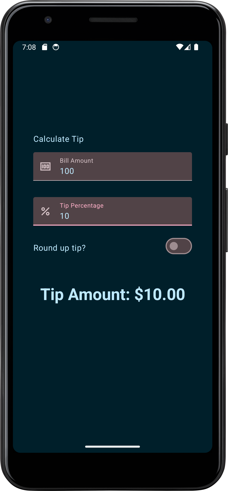
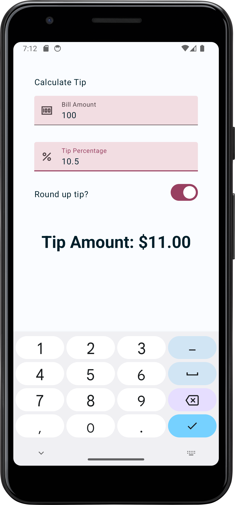

# Tip Calculator


The Tip Calculator is a handy Android application built with Kotlin using Jetpack Compose. It simplifies the process of calculating tips by allowing users to input the bill amount, select the tip percentage, and optionally round the tip amount. The app provides a seamless experience for both light and dark themes, ensuring optimal visibility in any lighting condition.

## Features

- **Calculate Tips**: Easily calculate tips by entering the bill amount and selecting the desired tip percentage.

- **Tip Rounding**: Optionally round the tip amount to the nearest whole number for convenience.

- **Scrollable Interface**: Enjoy a smooth and intuitive user experience with a scrollable interface, ensuring usability even for lengthy inputs.

## Screenshots

### Dark Theme


### Dark Theme



## Getting Started

### Prerequisites

- Android Studio Arctic Fox or later.
- Kotlin 1.5.0 or later.

### Installation

1. Clone the repository:

   ```bash
   https://github.com/IbrahimAlsaudi/tip-calculator-app.git


## Contributing

Contributions are welcome! If you find any issues or have suggestions for improvements, feel free to:

- Open an issue to report a bug or request a new feature.
- Create a pull request to propose changes or fixes.
